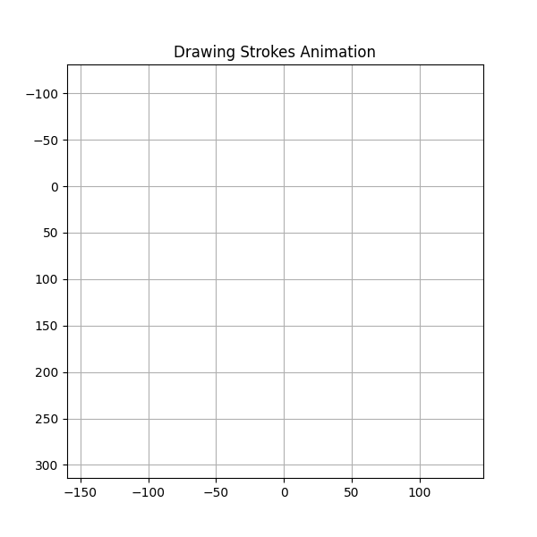
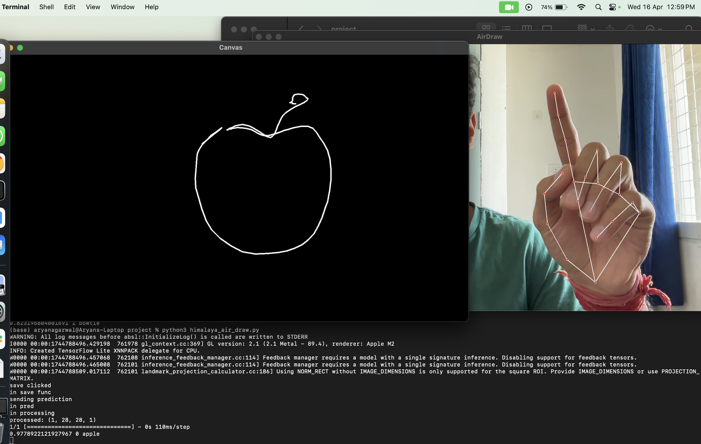

# QuickDraw Sketch Recognition: Comparative Deep Learning Study

This project presents a thorough **comparative and ablation study** on the task of **sketch classification** using the [Google QuickDraw dataset](https://quickdraw.withgoogle.com/data). We explore multiple modeling techniques using **stroke-sequence data**, **image-based inputs**, and a **hybrid multi-modal fusion model**. Each approach is evaluated for accuracy and parameter efficiency.

> Final deliverable includes a **real-time sketch inference system** using webcam strokes & image capture: `air_draw_final.py`

---

## What is Stroke Data?

In QuickDraw, each sketch is stored as a series of vectorized strokes (sequences of x-y coordinates and pen states). This temporal format is ideal for **sequence modeling** using **LSTM**, **ConvLSTM**, or **Transformers**.

Example of stroke input (GIF):



---

## 📸 Real-Time Inference Snapshot

Below is a demo of the **Hybrid Model** in action. The user draws an **apple** in the air. The model captures the stroke path + image and correctly classifies it as “Apple”.

 

> You can run this on your own using `python air_draw_final.py`.

---

## 🧪 Models & Comparative Results

| Technique                 | Parameters | Accuracy (%) |
|--------------------------|------------|--------------|
| **LSTM (Strokes)**           | 0.39M      | 81.93        |
| **ConvLSTM (Strokes)**       | 0.79M      | 87.43        |
| **Transformer (Strokes)**    | 0.62M      | 76.29        |
| **CNN (Image)**              | 0.23M      | 87.20        |
| **Vision Transformer (ViT)** | 7.93M      | 79.96        |
| **InceptionV3 (Pretrained)** | 0.28M–15.2M| 86.30        |
| **VGG (Pretrained)**         | 14.8M      | 88.10        |
| **ResNet50 (Pretrained)**    | 24.1M      | 79.49        |
| **MobileNetV2 (Pretrained)** | 2.5M       | 87.22        |
| 🏆 **Hybrid Model (Image + Strokes)** | 0.57M | **93.72**    |

---

## 🔍 Techniques Used

- **Stroke-based modeling** using:
  - **LSTM**, **ConvLSTM**, and **Transformer**
- **Image-based classification** using:
  - **CNN**, **Vision Transformers (ViT)**, and **Pretrained CNNs**
- **Hybrid approach**:
  - Combines stroke embeddings and CNN image features for **multi-modal classification**
  -  Parallel encoding (LSTM + CNN) and joint classifier
  - Achieved **best accuracy with minimal parameters**
- **Model Efficiency focus**:
  - Lightweight models like **MobileNet** and custom CNN for deployment suitability
- **Real-time sketch inference**:
  - Via webcam, combining **image + stroke capture**

---

## 🧑‍💻 Final Real-Time Inference System

`air_draw_final.py` is a live system that:

- Captures sketches **in the air** using webcam
- Extracts both **stroke sequence** and **image**
- Feeds them to the trained **hybrid model**
- Outputs the **predicted object** instantly


---

## 📂 Project Structure
```
├── air_draw_final.py # Real-time inference system
├── cnn_ablation_studies.ipynb # CNN-based image models
├── convlstm_training.ipynb # ConvLSTM model on strokes
├── hybrid_train.ipynb # Combined image + strokes hybrid model
├── inception_ablation.ipynb # InceptionV3 trials
├── MobileNetV2.ipynb # Lightweight MobileNet model
├── ResNet50.ipynb # ResNet-based experiments
├── strokes2_lstm_Colab.ipynb # Stroke LSTM training
├── strokes_local_trials_inf.ipynb # Stroke inference testing
├── transformers_strokes.ipynb # Transformer models on strokes
├── VGG.ipynb # VGG network evaluation
├── vit_training.ipynb # Vision Transformer on images: ViT for 28x28 grayscale sketch images  
├── project_report.pdf # Full technical report
├── CS776-God's Eye - Final PPT.pptx # Presentation
└── jclas/ # Supporting resources/scripts

```
---
## 📚 Files to Explore

| Notebook File               | Description                                  |
|----------------------------|----------------------------------------------|
| `cnn_ablation_studies.ipynb` | Custom CNNs with various depths              |
| `convlstm_training.ipynb`   | Sequence modeling using ConvLSTM             |
| `hybrid_train.ipynb`        | Full multimodal hybrid model training         |
| `transformers_strokes.ipynb`| Transformers for stroke data                 |
| `vit_training.ipynb`        | ViT for 28x28 grayscale sketch images        |
| `MobileNetV2.ipynb`         | Lightweight pretrained model experiments     |
| `air_draw_final.py`         | Real-time sketch drawing and recognition     |
---
---
## 🛠️ Tools & Libraries

- `TensorFlow`, `Keras`
- `OpenCV`, `Mediapipe` (for live webcam and drawing interface)
- `Matplotlib`, `Seaborn` for visualizations
- `transformers`, `timm`, `torchvision` for pretrained models
- `QuickDraw` dataset (100+ classes of human-drawn sketches)
---

